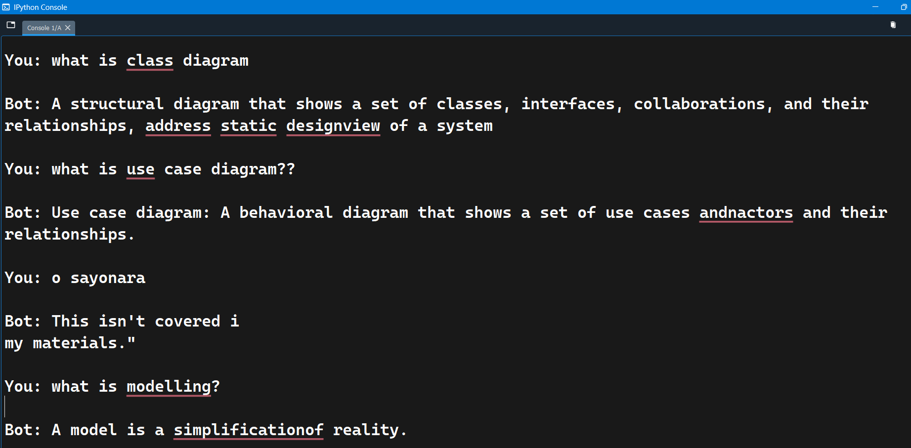

# PDF Chatbot with LangChain, Hugging Face, and Pinecone
#### (only answers content related to that pdf else it says it isnt covered in my materials) 
This project implements a PDF-based chatbot  that leverages LangChain for document loading and text splitting, Hugging Face for generating embeddings and text outputs, and Pinecone for vector storage and similarity search. The chatbot processes a PDF file, extracts and preprocesses its content, splits it into manageable chunks, indexes the chunks for semantic search, and finally answers user queries by retrieving relevant context and generating concise responses using the Google Flan-T5 model.




---

## Features

- **PDF Loading:** Uses `PyPDFLoader` to extract text from PDFs.
- **Text Preprocessing & Splitting:** Cleans text and splits it into chunks using `RecursiveCharacterTextSplitter` with token count constraints.
- **Embeddings & Vector Storage:** Generates text embeddings with the `sentence-transformers/all-mpnet-base-v2` model via `HuggingFaceEmbeddings` and stores them in a Pinecone vector index.
- **Semantic Search:** Retrieves relevant document chunks using a Pinecone-based retriever with Maximal Marginal Relevance (MMR) search.
- **Question Answering:** Uses a prompt template and the Google Flan-T5 model to generate concise answers based solely on the provided context.
- **Interactive Chat Interface:** Provides a command-line interface to interact with the chatbot.

---

## Installation

Ensure you have Python 3.7 or higher installed. Then, install the required packages. It is recommended to use a virtual environment:

1. **Create and activate a virtual environment (optional but recommended):**

   ```bash
   python -m venv venv
   source venv/bin/activate   # On Windows: venv\Scripts\activate
Acknowledgments
LangChain
Hugging Face Transformers
Pinecone
